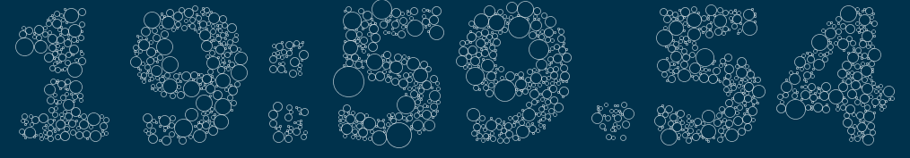

# CirclePackingClock

This is an animation written in the Processing language. It uses a circle packing algorithm to approximate the digits of a clock.



The basic idea of this is that we are drawing each letter with a white font on a black background in a backbuffer and then we can check
if a circle is "inside" or "outside" the shape by checking the brightness of the corresponding pixel in that backbuffer.

```processing
  public boolean touchesShape(int[] shape, int shapeW) {
    int top =    shape[floor(x - r) + floor(y)     * shapeW];
    int bottom = shape[floor(x + r) + floor(y)     * shapeW];
    int left =   shape[floor(x)     + floor(y - r) * shapeW];
    int right =  shape[floor(x)     + floor(y + r) * shapeW];
    
    return 
      brightness(left) < 30 ||
      brightness(right) < 30 ||
      brightness(top) < 30 ||
      brightness(bottom) < 30;
  }
```
We keep a list of `Symbol` objects, one for each digit (8 for a clock, including the colons). Each `Symbol` is responsible for handling the circles that draw them and
the backbuffer that define its edges.

```processing
  private PGraphics pg;  

  public void setText(char c) {
    if(this.c != c) {
      circles.clear();
      growingCircles.clear();
      pg.beginDraw();
      pg.background(0);
      pg.textFont(font);
      pg.stroke(255);
      pg.text(c, 0, pg.height - pg.textDescent());
      pg.endDraw();
      allowedPoints.clear();
      for(int x = 0 ; x < pg.width ; x++) {
        for(int y = 0 ; y < pg.height ; y++) {
          if(brightness(pg.pixels[x + y * pg.width]) != 0) {
            allowedPoints.add(new PVector(x, y));
          }
        }
      }
      targetCircles = (int)(allowedPoints.size() * CIRCLE_DENSITY);
    }
    this.c = c;
  }
```

Each digit starts with a few random circles of radius 1 and each frame, if the circle does not touch another circle, the edge of the screen or the edge of the digit shape
(in strict mode) we grow the radius by one. We add a few new circles each frame to keep things interesting.

```processing
  public void draw() {
    for(Circle c : circles) {
      c.draw();
    }
  }
  
  public void update() {
    if(circles.size() < targetCircles) {
      for(int i = 0 ; i < CIRCLES_PER_FRAME ; i ++) {
        addNewCircles();
      }
    }
    growCircles();
  }
```

We try to optimize things by keeping a list of "allowed points" - basically the number of points inside the letter shape and if at one point one of the points is found to be
inside a circle, we remove it from the list so that we don't have to check it again.

```processing
  public void addNewCircles() {
    while(!allowedPoints.isEmpty()) {
      PVector p = allowedPoints.remove((int)random(allowedPoints.size()));
      boolean found = false;
      for(Circle c : circles) {
        if(c.containsPoint(p.x, p.y)) {
          found = true;
          break;
        }
      }
      if(found) {
        continue;
      }
      Circle c = new Circle(p.x, p.y);
      circles.add(c);
      growingCircles.add(c);
      return;
    }
  }
```
